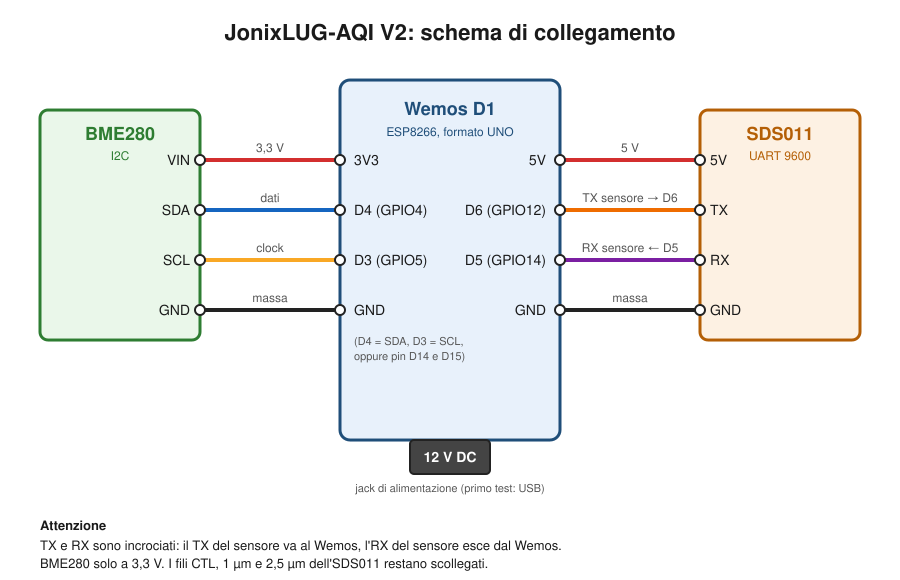

# JonixLUG-AQI — Centralina qualità dell'aria

Centralina open source per il monitoraggio della qualità dell'aria: particolato **PM2.5** e **PM10**, **temperatura**, **umidità** e **pressione atmosferica**, con compensazione algoritmica dei valori di particolato in base all'umidità relativa.

Fork del progetto originale [JonixLUG ABC](https://www.jonixlug.altervista.org/jonixlug-aria-bene-comune/) (GPLv3, 2019) con bugfix, pulizia del codice e invio multi-piattaforma.

## Dove finiscono i dati

Il firmware invia ogni lettura a più piattaforme in parallelo (ciascuna attivabile/disattivabile da `config.h`):

| Piattaforma | Tipo | Perché |
|---|---|---|
| [Sensor.Community](https://sensor.community/) | Rete globale citizen science | 15k+ stazioni, mappa pubblica, open data |
| [openSenseMap](https://opensensemap.org/) | Rete accademica open data | Università di Münster, download CSV, interpolazione |
| InfluxDB + Grafana | Self-hosted su server FareZero | Dashboard personalizzata su `aria.farezero.org` |
| Bot giardino | `@FareZeroMakersBot` | Comando `/aria` su Telegram (vedi [garden-button](https://github.com/f4rezer0/garden-button)) |

## Hardware

| Componente | Modello | Pin Wemos |
|---|---|---|
| Microcontrollore | Wemos D1 (ESP8266) | — |
| Temp + umidità + pressione | BME280 (I2C) | D3 (SCL), D4 (SDA), 3.3V, GND |
| Particolato PM2.5/PM10 | SDS011 (Nova Fitness) | D5 (GPIO14), D6 (GPIO12), 5V, GND |



TX e RX dell'SDS011 sono incrociati: il TX del sensore va a D6, l'RX a D5. Il BME280 va alimentato a 3,3 V.

Alimentazione: USB a 5 V (almeno 500 mA, consigliato 1 A) oppure jack DC a 12 V. Con il jack il regolatore onboard può scaldare: se serve, usare un buck 12V→5V sul pin 5V.

## Setup software

1. Installa [Arduino IDE](https://www.arduino.cc/en/software) (1.8.9+)
2. Aggiungi il board manager ESP8266:
   `File → Preferences → Additional Boards Manager URLs` →
   `https://arduino.esp8266.com/stable/package_esp8266com_index.json`
3. Copia la cartella `libraries/` nella cartella librerie di Arduino IDE (es. `~/Arduino/libraries/`)
4. Copia `config.h.example` in `config.h` e modifica i valori
5. Compila e carica `jonixlug-aqi-v2.ino` sulla board Wemos D1

## Configurazione

Tutti i parametri personalizzabili sono in **`config.h`** (copia da `config.h.example`):

```cpp
// Wi-Fi
const char* WIFI_SSID = "NOME_RETE_WIFI";
const char* WIFI_PASS = "PASSWORD_WIFI";

// Sensor.Community — automatico, basato sul chip ID
const bool ENABLE_SENSOR_COMMUNITY = true;

// openSenseMap — registra un box su opensensemap.org
const bool ENABLE_OPENSENSEMAP = true;
const char* OSM_BOX_ID = "IL_TUO_BOX_ID";
// ... + 5 sensor ID (PM10, PM2.5, Temp, Hum, Pressione)

// Server FareZero — InfluxDB e bot giardino (stesso token del pulsante giardino)
const char* FAREZERO_TOKEN = "IL_TUO_GARDEN_TOKEN";
const bool ENABLE_INFLUXDB = false;
const bool ENABLE_FAREZERO = false;
```

### Registrazione sensori

- **Sensor.Community**: registra su [devices.sensor.community](https://devices.sensor.community/) — il sensor ID è generato automaticamente dal chip ID dell'ESP8266
- **openSenseMap**: crea un account e registra un box su [opensensemap.org](https://opensensemap.org/), aggiungi 5 sensori (PM10, PM2.5, Temperatura, Umidità, Pressione) e copia gli ID nel `config.h`
- **InfluxDB / bot giardino**: il server FareZero espone `api.farezero.org/aria/write` e `api.farezero.org/garden/air` dietro Caddy (configurazione in `server/Caddyfile-snippet`); crea il database `airquality` e attiva i flag in `config.h` quando il server è pronto

## Cosa fa il firmware

Ogni ciclo (default 15 min):
1. Si connette al WiFi
2. Legge temperatura, umidità e pressione dal BME280
3. Sveglia l'SDS011, calibra la ventola (15s), raccoglie 10 campioni
4. Scarta i campioni fuori range e calcola la media
5. Normalizza i valori PM in base all'umidità (algoritmo di compensazione)
6. Invia i dati alle piattaforme abilitate
7. Spegne WiFi e sensore, dorme fino al ciclo successivo

## Modifiche V2 rispetto all'originale

- **BME280** al posto del DHT22: aggiunge la pressione atmosferica, precisione ±0.5°C (vs ±2°C)
- **Invio multi-piattaforma**: Sensor.Community + openSenseMap + InfluxDB al posto di ThingSpeak
- **Fix stack overflow**: le chiamate ricorsive a `loop()` sono state sostituite con `return`
- **Fix HTTP**: parsing risposta e formato richiesta corretti
- **Rimosso codice morto**: include e variabili inutilizzati
- **Configurazione separata** in `config.h` (con template `.example`)
- **HTTP client corretto** con `ESP8266HTTPClient` al posto di richieste raw
- **Campionamento robusto**: i campioni fuori range vengono saltati senza interrompere il ciclo

## Installazione della centralina

Tutta la centralina va dentro uno **Stevenson shield** stampato in 3D: un cilindro a lamelle sovrapposte, aperto sotto, che lascia circolare l'aria proteggendo da sole diretto e pioggia.

- Posizionare in zona ombreggiata, con accesso diretto all'aria esterna
- Protetta da pioggia (es. sotto un balcone o tettoia)
- L'SDS011 aspira l'aria col suo tubo — posizionarlo con l'ingresso aria rivolto verso il basso
- Il BME280 deve essere esposto all'aria, non chiuso vicino al Wemos (calore)

## Case 3D

Stevenson shield personalizzato per questa centralina (in lavorazione presso FareZero Makers Fab Lab).

Case originale V1: file `.stl` di Alessandro Chiffi / Ondata Studio nel [repo originale](https://gitlab.com/JonixLUG/jonixlug-aqi).

## Licenza e attribuzioni

**Codice: [GPLv3](LICENSE)** — **Dati raccolti: CC BY 4.0**

Progetto originale **JonixLUG ABC** — [jonixlug.altervista.org](https://www.jonixlug.altervista.org/jonixlug-aria-bene-comune/)

V2 by **William Donzelli** — **APS FareZero Makers Fab Lab** — [farezero.org](https://farezero.org)
